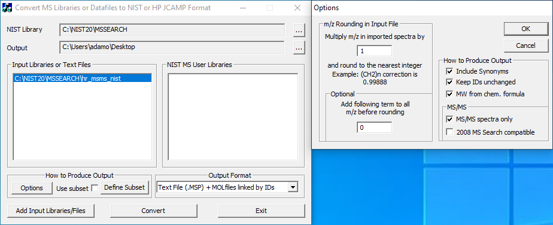

# MassFormer

This is the original implementation of MassFormer, a graph transformer for small molecule MS/MS prediction. Check out the preprint on [arxiv](https://arxiv.org/abs/2111.04824).

## System Requirements

This software requires a Unix-like operating system (we tested on Linux with Ubuntu 18.04).

For fast training/evaluation, a GPU compatible with [CUDA 11.3](https://developer.nvidia.com/cuda-11.3.0-download-archive) and at least 12GB VRAM is recommended.

We tested on an [Intel Xeon Silver 4110](https://ark.intel.com/content/www/us/en/ark/products/123547/intel-xeon-silver-4110-processor-11m-cache-2-10-ghz.html) system with an [Nvidia Tesla T4](https://www.nvidia.com/en-us/data-center/tesla-t4/) (16GB VRAM) or [Nvidia Quadro RTX 6000](https://www.nvidia.com/content/dam/en-zz/Solutions/design-visualization/quadro-product-literature/quadro-rtx-6000-us-nvidia-704093-r4-web.pdf) (24GB VRAM) and 64GB system RAM.

## Setting up the Environment

We recommend using [conda](https://docs.conda.io/en/latest/miniconda.html) to create an environment, then installing the packages using [pip](https://pypi.org/project/pip/). The massformer code is configured to work with CUDA 11.3. Other versions of CUDA will likely work, but the install will require some modification. We also provide instructions for setting up the code to run on CPU only.

The total install time should not take more than a few minutes.

### GPU Environment

Enter the root directory and run the following commands:

```
cd massformer
conda create -n MF-GPU -y
conda activate MF-GPU
conda install python=3.8 -y
```

Then, install the dependencies using pip:

```
pip install -r env/requirements-gpu.txt --extra-index-url https://download.pytorch.org/whl/cu113 -f https://data.pyg.org/whl/torch-1.12.1+cu113.html -f https://data.dgl.ai/wheels/repo.html
```

Finally, install massformer itself using pip:

```
pip install -I -e .
```

### CPU Environment

Enter the root directory and run the following commands:

```
cd massformer
conda create -n MF-CPU -y
conda activate MF-CPU
conda install python=3.8 -y
```

Then, install the dependencies using pip:

```
pip install -r env/requirements-cpu.txt --extra-index-url https://download.pytorch.org/whl/cpu -f https://data.pyg.org/whl/torch-1.12.1+cpu.html
```

Finally, install massformer itself using pip:

```
pip install -I -e .
```

## Downloading Everything

To download everything all at once, run the following script:

```
bash download_scripts/download_public.sh
```

The total size of the download is ~2.5GB (~17GB after decompression). If you run this step, you can safely skip every step that starts with "Downloading" ([this step](#downloading-demo-data-and-model-checkpoint), [this step](#downloading-the-raw-data), [this step](#downloading-the-casmipcasmi-processed-datasets), [this step](#downloading-the-cfm-predictions)).

Otherwise, you may simply download files incrementally throughout the setup process.

## Downloading Demo Data and Model Checkpoint

To download the data and model checkpoints, run the following command:

```
bash download_scripts/download_demo.sh
```

## Running the Demo

The parameters for a pretrained MassFormer model (trained on the MoNA dataset, using an InChIKey split, using [this config file](config/demo/demo_train.yml)) are located in [checkpoints/demo.pkl](checkpoints/demo.pkl). We provide a script that loads these parameters and makes predictions on a heldout subset of the MoNA dataset.

### GPU Demo

To run the GPU demo, use the following command:

```
python scripts/run_train_eval.py -c config/demo/demo_eval.yml -w off -d 0
```

It should take 1-2 minutes to run.

### CPU Demo

To run the CPU demo, use the following command:

```
python scripts/run_train_eval.py -c config/demo/demo_eval.yml -w off -d -1
```

It should take 5-10 minutes to run (predictions are significantly slower without a GPU).

### Expected Output

The script should produce the following output:

```
>>> mb_na
> num_spec = 13225, num_mol = 1376, num_group = 1424, num_ce_per_group = 9.287219101123595
>>> mol_embed_params = 48267329, mlp_params = 7800000, total_params = 56067329
> primary
splits: train, val, test, total
spec: 9543, 1097, 2585, 13225
mol: 964, 138, 274, 1376
>>> no checkpoint detected
>> test
> test: 100%|████████████████████████████████████████████████████████████████████████████████████████████████████████████████████████████████████████████████████████████████████████████████████████████████████████████████████████████████████| 104/104 [01:17<00:00,  1.34it/s]
> unmerged metrics: 100%|███████████████████████████████████████████████████████████████████████████████████████████████████████████████████████████████████████████████████████████████████████████████████████████████████████████████████████████| 1/1 [00:00<00:00, 116.11it/s]
> merged metrics: 100%|██████████████████████████████████████████████████████████████████████████████████████████████████████████████████████████████████████████████████████████████████████████████████████████████████████████████████████████████| 1/1 [00:00<00:00, 15.67it/s]
> test, mol_loss_obj_mean = 0.4836
```

`mol_loss_obj_mean` is the loss averaged over molecules (instead of individual spectra) on a heldout portion of the MoNA dataset. See the [config](config/demo/demo_eval.yml), the [loss definitions](src/massformer/losses.py), and the [runner file](src/massformer/runner.py) for more detailed information about metrics.

*Note: none of the steps below are required to run the demo, but are helpful for reproducing results from the paper.*

## Downloading the Raw Spectrum Data

Run the following scripts to download public spectral data: [MoNA](download_scripts/download_mona_raw.sh), [CASMI 2016/2022](download_scripts/download_casmi_raw.sh). These scripts will add files to the [data/raw](data/raw) directory.

```
bash download_scripts/download_mona_raw.sh
bash download_script/download_casmi_raw.sh
```

The [NIST 2020 MS/MS Library](https://www.nist.gov/programs-projects/nist20-updates-nist-tandem-and-electron-ionization-spectral-libraries) is not available for download directly, but can be purchased from an authorized distributor and exported using the instructions below.

## Exporting the NIST Data

*Note: this step requires a Windows System or Virtual Machine.*

*Note: these instructions are for NIST 2020, the NIST 2023 MS/MS Library does not support export with lib2nist.*

The spectra and associated compounds can be exported to MSP/MOL format using the free [lib2nist software](https://chemdata.nist.gov/mass-spc/ms-search/Library_conversion_tool.html). The resulting export will contain a single MSP file with all of the mass spectra, and multiple MOL files which include the molecular structure information (linked to the spectra by ID). The screenshot below indicates appropriate lib2nist export settings.



After exporting the files, create a directory "nist_20" in [data/raw](data/raw) on your primary computer and save them there. If done correctly, inside "nist_20" there should be a single .MSP file with all the spectra, `data/raw/nist_20/hr_nist_msms.MSP`, and a directory of .MOL files, `data/raw/nist_20/hr_nist_msms.MOL`.

There is a minor bug in the lib2nist export software that sometimes results in errors when parsing the MOL files. To fix this bug, run the following script:

```
python mol_fix.py --overwrite=True
``` 

This will edit the files in `data/raw/nist_20/hr_nist_msms.MOL` so that they can be parsed correctly.

## Preprocessing the Raw Spectrum Datasets

### Core Spectrum Datasets

To parse the core spectrum datasets, NIST and MoNA, run [parse_and_export.py](preproc_scripts/parse_and_export.py) using the following arguments:

NIST:

```
python preproc_scripts/parse_and_export.py --msp_file nist_20/hr_nist_msms.MSP --mol_dir nist_20/hr_nist_msms.MOL --output_name nist_df
```

MoNA:

```
python preproc_scripts/parse_and_export.py --msp_file mb_na_msms.msp --output_name mb_na_df
```

These scripts will create pandas dataframes (in json format) and save them in [data/df](data/df). Then, run [prepare_data.py](preproc_scripts/prepare_data.py) to convert these json dataframes in pickle dataframes that are used for model training and inference: 

```
python preproc_scripts/prepare_data.py
```

This will aggregate the NIST and MoNA data, and produce two pickle dataframes in [data/proc](data/proc): spec_df.pkl, which contains the spectrum information, and mol_df.pkl, which contains the structure information.

Both of these scripts using multiprocessing to speed up the computations: if your machine does not have many cores, it may be quite slow.

### Spectrum Identification Datasets

To parse and preprocess the datasets for the spectrum identification tasks, run the following scripts:

[CASMI 2016](preproc_scripts/prepare_casmi_data.py)

```
python preproc_scripts/prepare_casmi_data.py
```

[CASMI 2022](preproc_scripts/prepare_casmi22_data.py)

```
python preproc_scripts/prepare_casmi22_data.py
```

[NIST20 Outlier](preproc_scripts/prepare_pcasmi_data.py) (formerly pCASMI)

```
python preproc_scripts/prepare_pcasmi_data.py
```

By default, each of these scripts will save the preprocessed data in [data/proc](data/proc).

*Note: the preprocessed data for the spectrum identification tasks (CASMI 2016, CASMI 2022, NIST20 Outlier) are also available for download, see [the section below](#downloading-the-processed-spectrum-identification-datasets)*

## Downloading the Preprocessed Spectrum Identification Datasets

To obtain the preprocessed data that were used for spectrum identification in the paper, run the corresponding scripts for [CASMI 2016](download_scripts/download_casmi_2016_proc.sh), [CASMI 2022](download_scripts/download_casmi_2022_proc.sh) and [NIST Outlier](download_scripts/download_nist20_outlier_proc.sh). These scripts will add directories to the [data/proc](data/proc) directory.

```
bash download_scripts/download_casmi_2016_proc.sh
bash download_scripts/download_casmi_2022_proc.sh
bash download_scripts/download_nist20_outlier_proc.sh
```

## Downloading the CFM Predictions

To reproduce the CFM evaluation (see [Training and Evaluating a Model](#training-and-evaluating-a-model)), the CFM predictions for the NIST/MoNA compounds must first be downloaded using the [CFM download script](download_scripts/download_cfm_pred.sh):

```
bash download_scripts/download_cfm_pred.sh
```

## Setting Up Weights and Biases

Our implementation uses [Weights and Biases (W&B)](https://wandb.ai/site) for logging, checkpoint management, and visualization. For full functionality, you must set up a free W&B account.

Once you set up an account and a new project, you can edit the `entity_name` and `project_name` fields in the [template config](config/template.yml) to apply them globally to all configs in the repo.

## Training and Evaluating a Model

The model configs for the experiments are stored in the [config](config/) directory. They are organized as follows:

- [all_prec_type](config/all_prec_type): models trained on NIST data with multiple adducts
- [mh_prec_type](config/mh_prec_type): models trained on NIST data with [M+H]+ adducts
- [casmi](config/casmi): models used for CASMI 2016, CASMI 2022, and NIST20 Outlier spectrum identification evaluations
- [ablations](config/ablations): models used for ablation experiments

Configurations exist of MassFormer (MF) and the baseline methods (FP, WLN, and CFM). 

To train and evaluate a model, simply choose a configuration and pass it to the [run_train_eval.py](scripts/run_train_eval.py) script. For example, to run the [mona_scaffold_all_MF](config/all_prec_type/mona_scaffold_MF.yml) experiment (train MassFormer on NIST data, and evaluate on MoNA using a scaffold split), you can use the following command: 

```
python scripts/run_train_eval.py -c config/all_prec_type/mona_scaffold_all_MF.yml -w online
```

The `-w` argument controls the wandb logging (online, offline, or off). Note that training a model without a GPU will be very time-consuming.

The configurations in [casmi](config/casmi) perform spectrum identification evaluations. The other configurations only record similarity on a held-out test set (NIST or MoNA, depending on the configuration).

## Evaluating a Pretrained Model

Assuming you have downloaded the checkpoints, you can evaluate a pretrained model using the [run_train_eval.py](scripts/run_train_eval.py) script. However, you need to modify a few things in the config file first:

- In the "model" section, add the following line that specifies which checkpoint to load
```
checkpoint_name: "<model_checkpoint_filename>"
```
- In the "run" section, change the "num_epochs" field to 0 (this prevents any training iterations).

Continuing the example from the [Training and Evaluating a Model](#training-and-evaluating-a-model) section, if you want to evaluate a pretrained [mona_scaffold_all_MF](config/all_prec_type/mona_scaffold_MF.yml) model using the mona_scaffold_all_MF_0.pkl checkpoint, you can modify the config to look like the following:

```
run_name:
data:
  num_entries: -1
  primary_dset: ["nist"]
  secondary_dset: ["mb_na"]
  ce_key: "nce"
  inst_type: ["FT"]
  frag_mode: ["HCD"]
  pos_prec_type: ['[M+H]+', '[M+H-H2O]+', '[M+H-2H2O]+', '[M+2H]2+', '[M+H-NH3]+', "[M+Na]+"]
  fp_types:   ["morgan","rdkit","maccs"]
  preproc_ce: "normalize"
  spectrum_normalization: "l1"
  gf_algos_v: "algos2"
model:
  embed_types: ["gf_v2"]
  ff_layer_type: "neims"
  ff_h_dim: 1000
  ff_num_layers: 4
  ff_skip: True
  dropout: 0.4
  output_normalization: "l1"
  bidirectional_prediction: True
  gf_model_name: "graphormer_base"
  gf_pretrain_name: "pcqm4mv2_graphormer_base"
  fix_num_pt_layers: 0
  reinit_num_pt_layers: -1
  reinit_layernorm: True
  model_seed: 6666
  checkpoint_name: mona_scaffold_MF_0 ### CHANGED
run:
  loss: "cos"
  sim: "cos"
  lr: 0.001
  batch_size: 100
  clip_grad_norm: 5.0
  scheduler: "polynomial"
  scheduler_peak_lr: 0.0002
  weight_decay: 0.001
  pt_weight_decay: 0.0
  dp: False
  dp_num_gpus: 0
  flag: True
  num_epochs: 0 ### CHANGED
  num_workers: 8
  cuda_deterministic: False
  do_test: True
  do_casmi: False
  do_pcasmi: False
  do_casmi22: False
  save_state: True
  save_media: True
  log_auxiliary: True
  train_seed: 5585
  split_seed: 420
  split_key: "scaffold"
  log_tqdm: False
  grad_acc_interval: 2 # for 24GB
  test_sets: ["train","val","mb_na"]
  save_test_sims: True
  test_frac: 0.
```

This modified example config is saved [here](config/checkpoint_example/checkpoint_example.yml). Then, you can run the following command:

```
python scripts/run_train_eval.py -c config/checkpoint_example/mona_scaffold_all_MF_chkpt.yml -w online
```

## Using a Pretrained Model to Make Predictions

The [inference script](scripts/run_inference.py) allows a pretrained model to make predictions on a provided set of compounds:

```
python scripts/run_inference.py -c config/demo/demo_eval.yml -s predictions/example_smiles.csv -o predictions/example_predictions.csv -d 0
```

*Note: if you are using the MF-CPU environment, replace the `-d 0` argument with `-d -1`.*

The smiles file (`-s` argument, see [this file](predictions/example_smiles.csv) for an example) is a csv file with two columns: the first column is a molecule id, and the second column is the SMILES string. 

The output file (`-o` argument, see [this file](predictions/example_predictions.csv) for an example) is a csv file with 11 columns, including the predicted spectra and various metadata. Any SMILES strings that cannot be parsed correct, or are not supported by the model, will be omitted from the output.

The precursor adducts and normalized collision energies can be controlled via command-line arguments `--prec_types` and `--nces` (respectively). Intensity transformations and normalizations can also be configured with the `--transform` and `--normalization` arguments.

## Checkpoints for Models from the Manuscript

All models in the manuscript (except CFM) are trained on NIST 2020 MS/MS Library. NIST does not support redistribution of parameters for models trained on this library. As such, we cannot provide model checkpoints.

However, it should be possible to reproduce our models by following the instructions to [export](#exporting-the-nist-data) and [preprocess](#preprocessing-the-spectrum-datasets) the data, and training a model using the [training script](scripts/run_train_eval.py) with the appropriate config.

If you are having trouble, feel free to create a GitHub issue or send an email to ayoung [AT] cs [DOT] toronto [DOT] edu.

*Note: there are not any CFM checkpoints, since we use pre-computed CFM predictions (see [previous section](#downloading-the-cfm-predictions)) in our experiments. If you want to use a pretrained CFM model on your own data, visit [their website](https://cfmid.wishartlab.com/)*.

## Training a Model on All of the Data

It may be useful to get a version of MassFormer that is trained on all available data (i.e. both NIST 2020 and MoNA spectra). We have provided config files for such models in the [train_both](config/train_both) subdirectory. There are four different configs: two for training with all supported precursor adducts ([1.0 Da bin size](config/train_both/train_both_all_MF.yml), [0.1 Da bin size](config/train_both/train_both_all_MF_hr.yml)) and two for training for training with \[M+H\]+ precusor adducts ([1.0 Da bin size](config/train_both/train_both_mh_MF.yml), [0.1 Da bin size](config/train_both/train_both_mh_MF_hr.yml)).